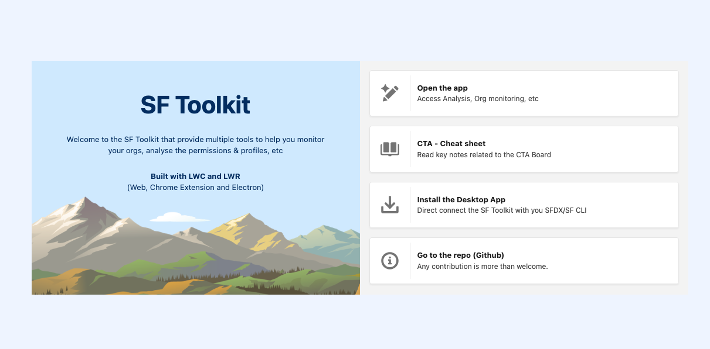
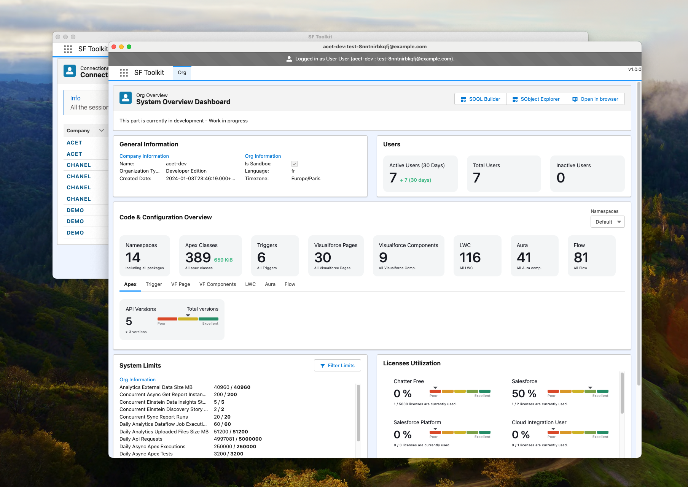
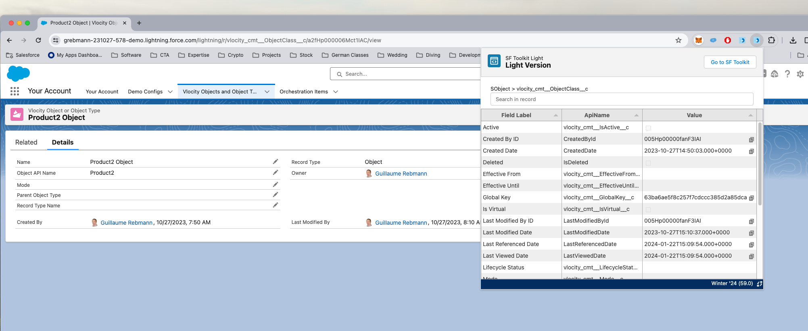

# SF Toolkit

This repository hosts the SF Toolkit , offering a comprehensive suite of tools for Salesforce administration, accessible through multiple platforms including the SF Toolkit website, an Electron desktop application, and a Chrome Extension.




## Roadmap

- ✅ User (Access & Usage) reporting (with PDF export)
- ✅ Org Dashboard (Work in progress)
- ✅ SOQL Builder
- ✅ Metadata Viewer (Work in progress)
- ✅ Code Extractor & Analyzer (Work in progress)
- ✅ Electron App for Mac OS [Install Latest Release](https://github.com/grebmann1/sfdx-ui-light/releases/latest)
- ✅ Chrome Extension available in the [Install Chrome Extension](https://chromewebstore.google.com/detail/sf-toolkit-light/konbmllgicfccombdckckakhnmejjoei)
- Middleware hooks to debug callouts
- Datamodel viewer
- Experience Cloud (Guest User review)

## Features

### SF Toolkit Website

Visit [SF Toolkit](https://www.sf-toolkit.com) to access the full suite of Salesforce management tools, including user access verification, connection management, and in-depth analysis of profiles, permissions, and more.

### Electron Desktop App

Utilize the Electron-based desktop application powered by Salesforce Developer Experience (SFDX) in the background. This app provides a seamless desktop experience for managing Salesforce connections, analyzing access rights, and visualizing user permissions. Instructions for setup and usage are available in the respective app directories.



### Chrome Extension

The Chrome Extension integrates directly into your browser, offering quick access to SF Toolkit functionality. Visualize profiles, manage connections, and export data as CSV or PDF—all from within your browser for streamlined Salesforce access management.



## Installation and Usage

### Install entire repo
1. Clone the repo.
2. Run `npm install`
3. Create a Salesforce Connected APP:

Create a .env file with the clientId and clientSecret from your salesforce connected app : 
```
CLIENT_SECRET='XXXXX'
CLIENT_ID='XXXX'
```


### SF Toolkit Website
- Visit [SF Toolkit](https://www.sf-toolkit.com) and connect your orgs (Org informations are only store localy in the browser)

#### Run Dev mode
Run `npm run start:dev:client`

#### Run Prod mode (static version)
1. Run `npm run heroku-postbuild`.
2. Run `npm run start:heroku`

Heroku isn't needed but if you want to test it with heroku, you need to follow these steps (After Heroku CLI installation)
1. Run `npm run heroku-postbuild`.
2. Run `heroku local --port 3000`

### Electron Desktop App
- Navigate to the 'src/electron' directory for detailed instructions on setting up and using the Electron desktop app.

#### Run electron App (Prod)
1. Run `cd src/electron`
2. Run `npm run start:electron:prod`

#### Run electron App (Development with localhost)
1. Run `cd src/electron`
2. Run `npm run start:dev:electron`

### Chrome Extension
- Refer to the 'extension' directory for installation steps and usage guidelines of the Chrome Extension.

#### Test with developer mode enabled (In Chrome)
1. Clone the repo.
2. Run `npm install`
3. Open `chrome://extensions/`.
4. Enable `Developer mode`.
5. Click `Load unpacked extension...`.
6. Select the folder `extension` that contain the extension module


## Contribution

We welcome contributions to enhance SF Toolkit. Feel free to fork the repository, make improvements, and create pull requests.

## Open Source Acknowledgments

This tool incorporates components from the following open source project:

- **[LWC SOQL Builder](https://github.com/lwc-soql-builder/lwc-soql-builder)**  
  Description: LWC SOQL Builder is an open source tool designed to build Salesforce Object Query Language (SOQL) queries in a dynamic and user-friendly interface.
  License: MIT
  Technology: LWC & NodeJS

We are thankful to the developers and contributors of the LWC SOQL Builder for their exceptional work. Their project plays a crucial role in the functionality of our tool.


## Support

For any issues, queries, or suggestions, please open an issue in the respective app's directory or contact us directly.

## License

This project is licensed under the MIT License