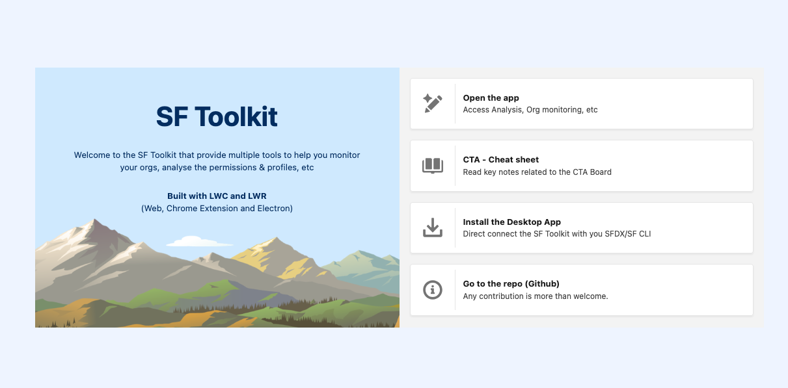
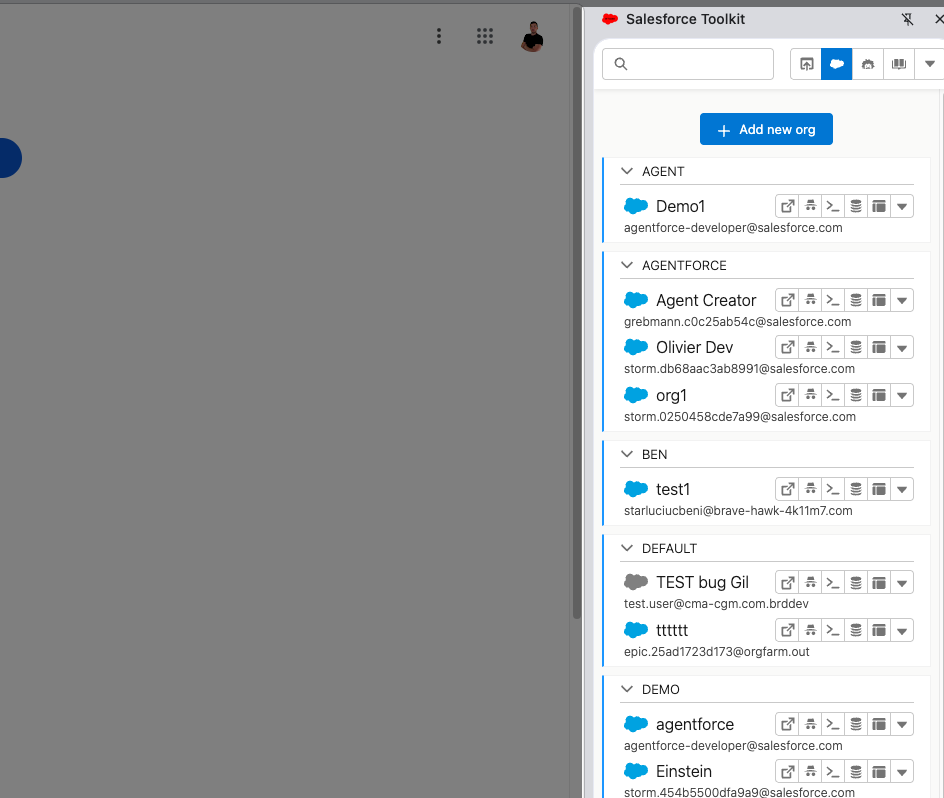
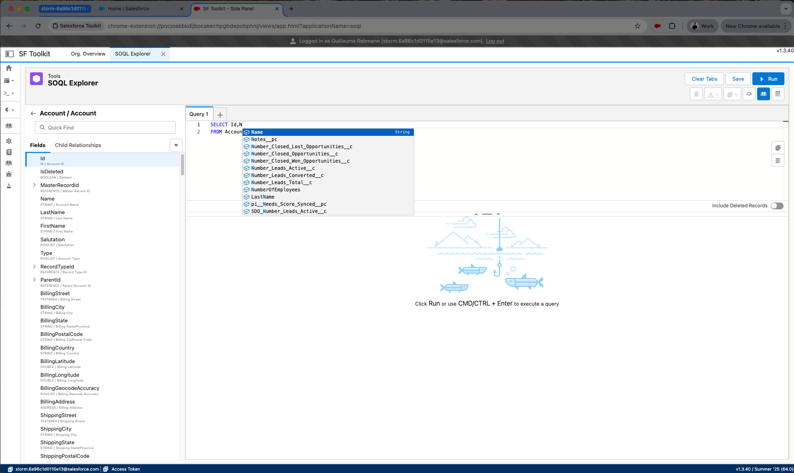
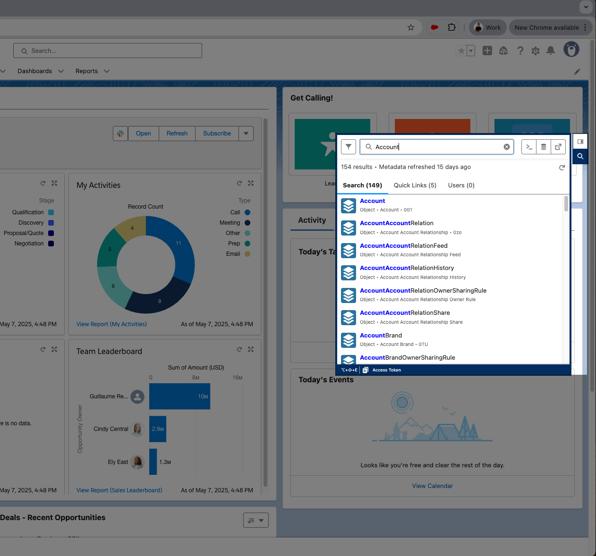
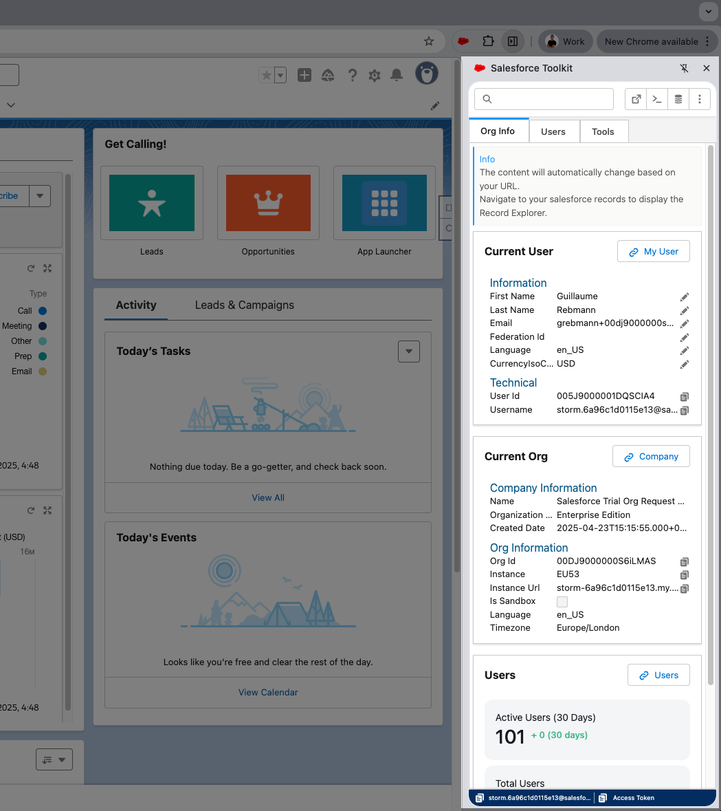
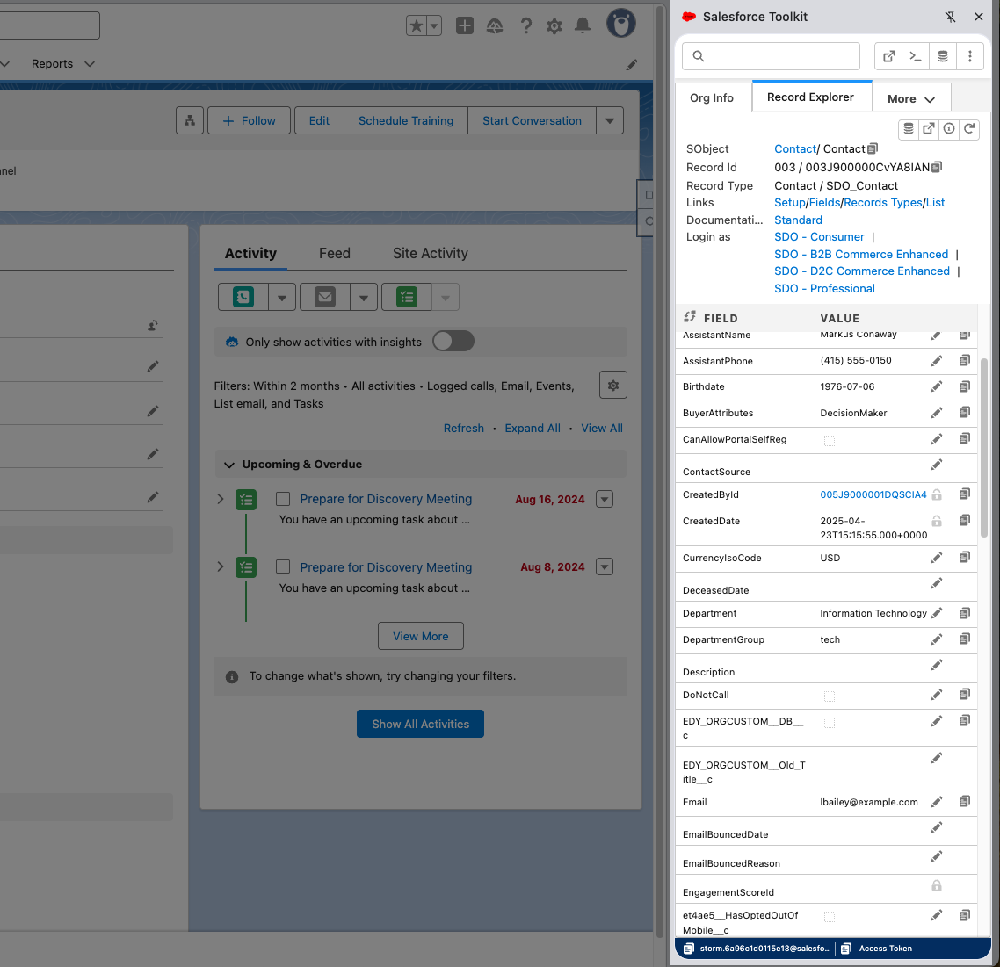

# Workbench 2.0 Web

Workbench 2.0 Web is a Salesforce administration toolkit delivered as:
- a web app (`packages/lwc` + `packages/server`)
- a Chrome extension (`packages/extension`)

It includes tools for org exploration, SOQL, metadata, API testing, platform events, and AI-assisted workflows.



## What You Get

- Org analysis and explorer tools (objects, metadata, records, org stats)
- Data tooling (SOQL, imports, exports, comparisons)
- API and event tooling (REST explorer, platform events)
- Connection management (OAuth/session, import/export helpers)
- AI assistant experience integrated in the app

## Repository Layout

- `packages/lwc/app` - Main LWC application modules
- `packages/lwc/web-extension` - LWC modules specific to extension surfaces
- `packages/server` - Dev/prod backend server modules plus LWR assets/layouts/hooks/content
- `packages/extension` - Chrome extension entry points and manifest template
- `packages/shared/modules` - Shared cross-target modules (`shared/*`)
- `packages/workers/src` - Worker source files
- `packages/vendor-bundles` - Vendor build wrappers (OpenAI/just-bash)
- `tools/build` - Rollup configs
- `tools/scripts` - Utility scripts and generators
- `assets` - Shared repository assets (`images`, `skills`, `data`, docs/refactor notes)
- `dist` - Build outputs (`dist/web`, `dist/extension`)

## Prerequisites

- Node.js `22.14` (matches `package.json` engines)
- npm

## Setup

```sh
git clone https://github.com/grebmann1/sf-toolkit-web.git
cd sf-toolkit-web
npm install
```

Create a `.env` file in the project root:

```sh
CLIENT_SECRET='YOUR_CLIENT_SECRET'
CLIENT_ID='YOUR_CLIENT_ID'
```

Optional vars:
- `PORT` (default `3000`)
- `REDIRECT_URI`
- `DOC_VERSION`
- `CHROME_ID`
- `PROXY_URL`

## Architecture Notes

- `lwr.config.json` controls routes, module resolution, and static assets for the web app.
- Rollup configs under `tools/build` control extension and worker bundles.
- Vendor browser bundles are generated under `packages/vendor-bundles` and copied into `packages/server/assets/libs`.
- Agent default skill content is generated into `packages/shared/modules/defaultAgentSkills`.

## HMR Notes

- A known LWR issue can break hot reload by dropping the LWC namespace during recompilation.
- This project auto-applies a patch after install via:
  - `npm run postinstall`
  - script: `tools/scripts/patch_lwr_hmr_namespace.mjs`
- If hot reload behaves inconsistently, clear cache and restart dev server:

```sh
rm -rf __lwr_cache__
npm run start:dev:web
```

## Common Commands

### Web App

- Dev server:
```sh
npm run start:dev:web
```

- Production build:
```sh
npm run build:web
```

- Production server:
```sh
npm run start:prod:server
```

- Build and run production:
```sh
npm run start:prod:web
```

### Desktop App

- Build the desktop package:
```sh
npm run build:desktop
```

- Start the desktop app against an already-running local web server:
```sh
npm run start:dev:desktop
```

- Start both the local web server and the desktop app together:
```sh
npm run start:dev:desktop:all
```

- Open the desktop app through the launcher CLI:
```sh
npm run desktop:open
```

### Chrome Extension

- Dev (main + sandbox watch + local serve):
```sh
npm run start:dev:extension
```

- Production build (extension + workers):
```sh
npm run build:prod:extension
```

- Main-only build:
```sh
npm run build:extension:main
```

### Workers

```sh
npm run watch:workers
npm run build:workers
```

### Quality / Validation

```sh
npm run lint
npm run check
npm run validate
```

## Where To Add Code

- New app-level pages/features: `packages/lwc/app/pages` and `packages/lwc/app/application`
- Shared LWC UI shell elements: `packages/lwc/app/component`
- Extension-only components: `packages/lwc/web-extension`
- Cross-target reusable modules: `packages/shared/modules`
- Server hooks/routes/content/layout changes: `packages/server`

## Chrome Extension Local Load

1. Build extension output (`npm run build:dev:extension`).
2. Open `chrome://extensions/`.
3. Enable **Developer mode**.
4. Click **Load unpacked**.
5. Select `dist/extension`.

Note: the extension build outputs `manifest.json` in `dist/extension` (generated from `manifest.template.json`).

## Screenshots







## Roadmap (Condensed)

- Continue improving code analyzer and metadata tooling
- Expand data/object assignment analysis
- Improve extension localhost and debugging workflows
- Incrementally improve shared module boundaries and package ergonomics

## Contribution

Contributions are welcome. Please open issues or pull requests for improvements, fixes, and new tooling modules.

## Open Source Acknowledgments

- [LWC SOQL Builder](https://github.com/lwc-soql-builder/lwc-soql-builder)
- [Salesforce Inspector Reloaded](https://github.com/tprouvot/Salesforce-Inspector-reloaded)

## License

MIT
