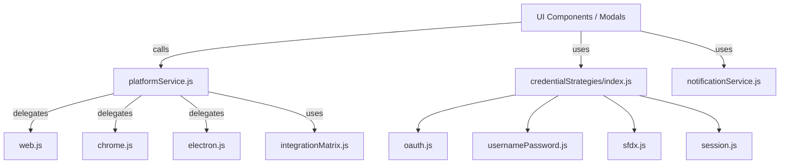

# Connection Module Refactoring Plan

## Overview
This document outlines the step-by-step plan to refactor the `connection` module for improved maintainability, scalability, and extensibility, while keeping modal components separated for clarity.

---

## Architecture Overview (Diagram)



**Description:**
- All UI components and modals interact with `platformService.js` for platform-specific operations and with the credential strategy registry for authentication flows.
- `platformService.js` delegates to the correct platform implementation (`web.js`, `chrome.js`, `electron.js`).
- The credential strategy registry routes to the correct handler for each credential type.
- The integration matrix and notification service are used throughout for validation and user feedback.

---

## 1. Centralize Platform Logic

**Goal:** Remove scattered platform checks and centralize platform-specific logic.

**Why?**
- Reduces code duplication and branching logic in UI and business logic.
- Makes it easier to add new platforms or update platform-specific behavior.
- Improves testability and maintainability.

**Detailed Steps**

1. **Create `platformService.js` in `src/client/modules/connection/utils/`.**
   - This file will be the single entry point for all platform-specific operations.

2. **Define a Platform Enum or Constant:**
   ```js
   // platformService.js
   export const PLATFORM = {
     WEB: 'web',
     CHROME: 'chrome',
     ELECTRON: 'electron',
   };
   ```

3. **Implement Platform Detection Logic:**
   ```js
   export function getCurrentPlatform() {
     if (window?.electron) return PLATFORM.ELECTRON;
     if (window?.chrome?.runtime?.id) return PLATFORM.CHROME;
     return PLATFORM.WEB;
   }
   ```

4. **Wrap Platform-Specific Methods:**
   - For each operation (e.g., `getConfigurations`, `connect`, `removeConfiguration`), create a function that delegates to the correct implementation:
   ```js
   import * as web from './web';
   import * as chrome from './chrome';
   import * as electron from './electron';

   export function getConfigurations() {
     switch (getCurrentPlatform()) {
       case PLATFORM.ELECTRON: return electron.getConfigurations();
       case PLATFORM.CHROME: return chrome.getConfigurations();
       default: return web.getConfigurations();
     }
   }
   // Repeat for other operations...
   ```

5. **Update All Imports:**
   - Refactor all code (modals, app, utils) to import and use `platformService.js` instead of directly importing platform-specific files or using `isElectronApp()`/`isChromeExtension()` checks.

6. **Testing:**
   - Add unit tests for `platformService.js` to ensure correct delegation and platform detection.

**Example Usage**
```js
import { getConfigurations } from 'connection/utils/platformService';
const configs = await getConfigurations();
```

**Migration Checklist**
- [ ] Create `platformService.js`
- [ ] Move all platform detection logic here
- [ ] Refactor all platform-specific imports/usages
- [ ] Add tests

---

## 2. Credential Type Strategy Pattern

**Goal:** Encapsulate logic for each credential type in its own handler.

**Why?**
- Avoids large switch/case or if/else blocks for credential handling.
- Makes it easy to add, test, or update credential types independently.
- Promotes single responsibility and separation of concerns.

**Detailed Steps**

1. **Create a `credentialStrategies/` folder in `src/client/modules/connection/utils/`.**
   - Each credential type (OAuth, Username/Password, SFDX, Session) will have its own file.

2. **Define a Common Interface:**
   - Each strategy should export a `connect(params)` function (and optionally, `validate(params)`, `disconnect()`, etc.).
   - Example:
   ```js
   // credentialStrategies/oauth.js
   export function connect(params) { /* ... */ }
   export function validate(params) { /* ... */ }
   ```

3. **Implement Each Strategy:**
   - Move existing logic for each credential type from modals/app/utils into its respective strategy file.
   - Example files:
     - `oauth.js`
     - `usernamePassword.js`
     - `sfdx.js`
     - `session.js`

4. **Create a Strategy Registry:**
   - In `credentialStrategies/index.js`, export a map of credential type to strategy:
   ```js
   import * as oauth from './oauth';
   import * as usernamePassword from './usernamePassword';
   import * as sfdx from './sfdx';
   import * as session from './session';

   export default {
     OAUTH: oauth,
     USERNAME: usernamePassword,
     SFDX: sfdx,
     SESSION: session,
   };
   ```

5. **Update Usage in Modals/App:**
   - Instead of handling credential logic inline, import the registry and call the correct strategy:
   ```js
   import credentialStrategies from 'connection/utils/credentialStrategies';
   const strategy = credentialStrategies[credentialType];
   await strategy.connect(params);
   ```

6. **Testing:**
   - Add unit tests for each strategy file.
   - Test the registry and integration with modals/app.

**Example Usage**
```js
import credentialStrategies from 'connection/utils/credentialStrategies';
const result = await credentialStrategies[credentialType].connect(params);
```

**Migration Checklist**
- [ ] Create `credentialStrategies/` folder and files
- [ ] Move logic for each credential type into its strategy file
- [ ] Create a registry in `index.js`
- [ ] Refactor modals/app to use strategies
- [ ] Add tests

---

## 3. Integration Type & Platform Matrix

**Goal:** Make it easy to know which credential types are available for each platform, and drive both UI and logic from this.

**Why?**
- Prevents unsupported credential types from being shown or used on the wrong platform.
- Centralizes the logic for which integrations are available where, making it easy to update or extend.
- Simplifies UI logic and validation.

**Detailed Steps**

1. **Create `integrationMatrix.js` in `src/client/modules/connection/utils/`.**
   - This file will export a matrix object mapping platforms to supported credential types.

2. **Define the Matrix:**
   ```js
   // integrationMatrix.js
   export default {
     web: ['OAUTH', 'USERNAME', 'REDIRECT', 'SESSION'],
     chrome: ['OAUTH', 'USERNAME', 'REDIRECT', 'SESSION'],
     electron: ['OAUTH', 'USERNAME', 'SFDX', 'SESSION'],
   };
   ```

3. **Create Helper Functions:**
   - Add functions to check if a credential type is supported on the current platform, and to get the list of supported types.
   ```js
   import matrix from './integrationMatrix';
   import { getCurrentPlatform } from './platformService';

   export function getSupportedCredentialTypes() {
     return matrix[getCurrentPlatform()];
   }
   export function isCredentialTypeSupported(type) {
     return getSupportedCredentialTypes().includes(type);
   }
   ```

4. **Update UI Logic:**
   - Use `getSupportedCredentialTypes()` to show/hide credential type options in forms and modals.
   - Use `isCredentialTypeSupported()` to validate user selections before proceeding.

5. **Update Business Logic:**
   - Before attempting to use a credential strategy, check if it is supported for the current platform.

6. **Testing:**
   - Add tests for the matrix, helper functions, and UI logic.

**Example Usage**
```js
import { getSupportedCredentialTypes } from 'connection/utils/integrationMatrix';
const options = getSupportedCredentialTypes();
```

**Migration Checklist**
- [ ] Create `integrationMatrix.js` and define the matrix
- [ ] Add helper functions for supported types
- [ ] Refactor UI to use the matrix for options
- [ ] Add validation using the matrix
- [ ] Add tests

---

## 4. Unify Connection Data Model

**Goal:** Ensure all connection objects have a consistent shape, regardless of platform or credential type.

**Why?**
- Prevents bugs and confusion caused by inconsistent data structures.
- Makes it easier to display, validate, and manipulate connection data across the app.
- Simplifies integration with UI components and storage.

**Detailed Steps**

1. **Define a `Connection` Type/Interface:**
   - Create a file (e.g., `connectionModel.js` or `connectionModel.ts`) in `src/client/modules/connection/utils/`.
   - Define the standard shape for a connection object, including required and optional fields.
   - Example (JS):
   ```js
   // connectionModel.js
   /**
    * @typedef {Object} Connection
    * @property {string} id
    * @property {string} alias
    * @property {string} username
    * @property {string} instanceUrl
    * @property {string} [refreshToken]
    * @property {string} [accessToken]
    * @property {string} [orgType]
    * @property {string} [credentialType]
    * @property {string} [company]
    * @property {string} [name]
    * @property {string} [_typeClass]
    * @property {string} [_statusClass]
    * @property {boolean} [_hasError]
    * ...
    */
   ```
   - If using TypeScript, define an interface instead.

2. **Normalize All Data Sources:**
   - Update all platform-specific and credential strategy files to return connection objects in this standard shape.
   - Add normalization functions if needed (e.g., `normalizeConfiguration(rawData)`).

3. **Update UI and Business Logic:**
   - Refactor all code that consumes connection objects to rely on the unified model.
   - Remove any legacy code that expects old/variant shapes.

4. **Testing:**
   - Add tests for the normalization logic and for any code that consumes connection objects.

**Example Usage**
```js
import { normalizeConfiguration } from 'connection/utils/connectionModel';
const connection = normalizeConfiguration(rawData);
```

**Migration Checklist**
- [ ] Define the `Connection` type/interface
- [ ] Normalize all data sources to this model
- [ ] Refactor UI/business logic to use the unified model
- [ ] Add tests

---

## 5. Centralize Notification & Error Handling

**Goal:** Avoid repeated toast/alert logic and ensure consistent user feedback.

**Why?**
- Ensures a consistent user experience for all notifications and errors.
- Reduces code duplication and risk of missing error handling.
- Makes it easier to update notification styles or logic in one place.

**Detailed Steps**

1. **Create `notificationService.js` in `src/client/modules/connection/utils/`.**
   - This file will export functions for showing toasts, alerts, and handling errors.

2. **Define Notification Methods:**
   - Implement methods such as `showToast({ label, variant })`, `showAlert({ message, theme, label })`, and `handleError(error, context)`.
   - Example:
   ```js
   // notificationService.js
   import Toast from 'lightning/toast';
   import LightningAlert from 'lightning/alert';

   export function showToast({ label, variant = 'info' }) {
     Toast.show({ label, variant });
   }

   export function showAlert({ message, theme = 'error', label = 'Error!' }) {
     LightningAlert.open({ message, theme, label });
   }

   export function handleError(error, context = '') {
     // Log error, show toast/alert, and optionally report to monitoring
     showToast({ label: `${context}: ${error.message || error}`, variant: 'error' });
     // Optionally: send to error tracking service
   }
   ```

3. **Update All Modals and App Logic:**
   - Refactor all places where toasts/alerts/errors are shown to use the notification service.
   - Remove direct calls to `Toast.show`, `LightningAlert.open`, etc.

4. **Add Contextual Error Handling:**
   - Use `handleError` to provide context-specific error messages and logging.

5. **Testing:**
   - Add tests for the notification service and for error handling in modals/app.

**Example Usage**
```js
import { notificationService } from 'connection/utils';
const { showToast, handleError } = notificationService
showToast({ label: 'Connection successful!', variant: 'success' });
try {
  // ...
} catch (e) {
  handleError(e, 'Connecting to org');
}
```

**Migration Checklist**
- [ ] Create `notificationService.js` and implement methods
- [ ] Refactor all notification/error logic to use the service
- [ ] Add contextual error handling
- [ ] Add tests

---

## 6. Testing & Documentation

**Goal:** Make the new structure easy to test and extend.

**Why?**
- Ensures reliability and prevents regressions during and after refactoring.
- Makes it easier for new contributors to understand and extend the codebase.
- Provides confidence when adding new features or credential types.

**Detailed Steps**

1. **Add Unit Tests for Core Modules:**
   - Write tests for `platformService.js`, each credential strategy, the integration matrix, and the notification service.
   - Use mocks/stubs for platform APIs and UI components as needed.
   - Example (using Jest):
   ```js
   import { getCurrentPlatform } from 'connection/utils/platformService';
test('detects electron platform', () => {
  // ...
});
   ```

2. **Add Integration Tests:**
   - Test the flow from UI (modals/app) through to the strategies and platform service.
   - Ensure all supported credential types and platforms are covered.

3. **Document the New Architecture:**
   - Update or create markdown files in `refactor-docs/` to explain:
     - The overall architecture and flow
     - How to add a new credential type or platform
     - Where to find and how to use the matrix, strategies, and services
   - Include diagrams or flowcharts if helpful.

4. **Add Usage Examples:**
   - Provide code snippets for common tasks (e.g., connecting, showing notifications, adding a new strategy).

5. **Track Progress:**
   - Use checklists in the documentation to track migration and testing progress.

**Example Checklist**
- [ ] Unit tests for platformService
- [ ] Unit tests for each credential strategy
- [ ] Unit tests for integration matrix
- [ ] Unit tests for notification service
- [ ] Integration tests for UI flows
- [ ] Architecture documentation
- [ ] Usage examples

**Migration Checklist**
- [ ] Add unit and integration tests for all modules
- [ ] Document architecture and extension points
- [ ] Provide usage examples
- [ ] Track progress in documentation

---

## 7. Cleaning, Refactoring & Optimization Plan (2024-xx-xx)

### Goals
- Remove redundant or duplicate logic (e.g., double saveConfiguration calls)
- Guarantee all connection data is always normalized (use normalizeConfiguration everywhere)
- Improve reusability and single-responsibility in credential strategies and platformService
- Review modal and utility usage for consistency and best practices
- Ensure all connection operations (save, update, connect, etc.) use a single, consistent data flow

### Key Issues Identified
- `setUsernamePasswordCredential` and `oauth_extend` both call `saveConfiguration`, causing redundant writes
- Some credential strategies do not always normalize data before returning or saving
- PlatformService and credential strategies sometimes duplicate logic (e.g., normalization, error handling)
- Modal components (like connectionRenameModal) could use more shared utilities for validation and feedback

### Refactor Steps
1. **Remove Redundant saveConfiguration Calls**
   - Refactor `setUsernamePasswordCredential` and `oauth_extend` so configuration is only saved once per operation.
   - Audit all credential strategies for similar issues.
2. **Enforce Data Normalization**
   - Ensure all connection objects are passed through `normalizeConfiguration` before being saved, returned, or used in the UI.
   - Add tests to catch unnormalized data.
3. **Centralize Save/Update Logic**
   - Move all save/update logic to a single utility or service (preferably via platformService), and call it from strategies.
   - Remove direct calls to webInterface.saveConfiguration from strategies/utilities.
4. **Improve Credential Strategy API**
   - Ensure all strategies return a normalized connection object and never mutate input.
   - Document expected input/output for each strategy.
5. **Review Modal and Utility Usage**
   - Refactor modal logic to use shared validation and notification utilities.
   - Ensure all modals use the same error/feedback patterns.
6. **Add/Update Tests**
   - Add unit tests for all refactored logic, especially normalization and save/update flows.
7. **Document Changes**
   - Update this plan and the main refactor docs as changes are made.

### Next Steps
- [ ] Refactor setUsernamePasswordCredential and oauth_extend to remove double save
- [ ] Audit all credential strategies for redundant logic and normalization
- [ ] Centralize save/update logic
- [ ] Refactor modal validation/notification
- [ ] Add/Update tests
- [ ] Document progress

---

## Summary Table

| Refactor Area                | What to Do                                      | Benefit                        |
|------------------------------|-------------------------------------------------|--------------------------------|
| Platform Logic               | Centralize in `platformService.js`              | No more scattered checks       |
| Credential Type Handling     | Use strategy pattern in `credentialStrategies/` | Easy to add new types          |
| Integration Matrix           | Single source of truth for UI/logic             | No more hardcoded options      |
| Connection Data Model        | Enforce consistent shape                        | Fewer bugs, easier refactoring |
| Notification/Error Handling  | Centralize in `notificationService.js`          | Consistent UX                  |
| Testing/Docs                 | Add tests and docs                              | Maintainability                |

---

## Next Steps

1. **Create `platformService.js` and migrate all platform logic.**
2. **Implement credential strategies and refactor modals/app to use them.**
3. **Add the integration matrix and update UI logic.**
4. **Standardize the connection data model.**
5. **Centralize notifications.**
6. **Write tests and documentation.** 